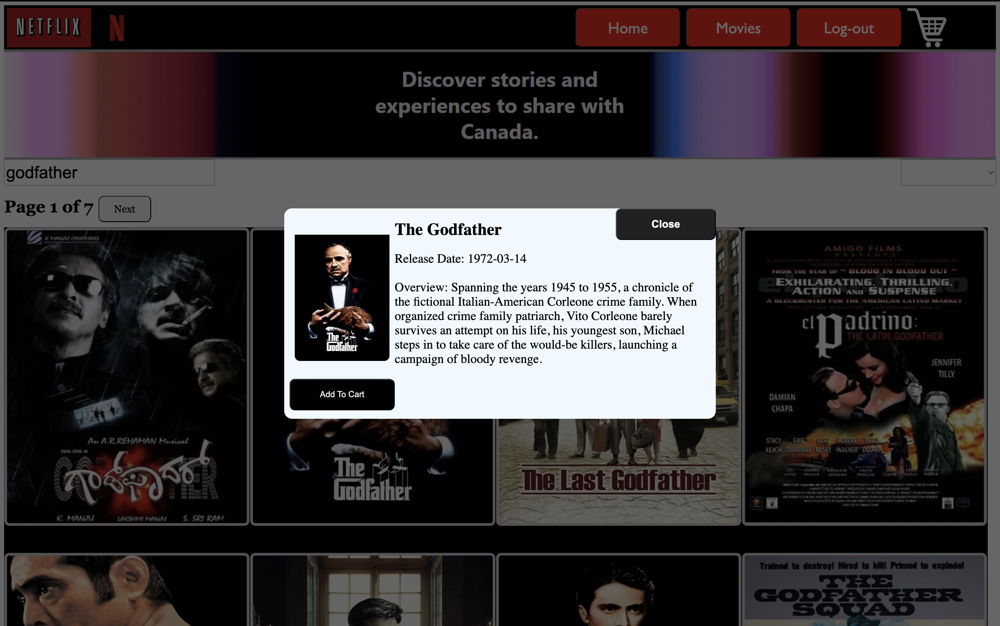

# 🎬 Netflix Movie Explorer

**Netflix Movie Explorer** is a sleek and responsive Vue 3 application that lets you search, explore, and browse movie data in real time — all powered by public APIs and Firebase Hosting.

> Built with 💡 Vite + Vue 3 + Firebase

---

## 👤 Author

Developed by [Ao Tian](https://github.com/TA-SWJD)

## 🚀 Features

- Register & Login with Google Directly
- 🔍 Real-time movie search
- 📺 Responsive UI inspired by Netflix
- 🌐 Vue Router for seamless navigation

---

## 🖼️ Screenshots

### 🎬 Homepage

### 🎬 Register & Login

### 🔍 Movie Search in Action

### 📱 Movie Description

## 🔧 How to run

Open the code in VScode (intended) and open your Terminal
# 1. Install dependencies
npm install

# 2. Run local dev server
npm run dev

# 3. Run the url locally in your browser
http://localhost:(4 digits number)

## ⚠️ Disclaimer

This project is intended solely for **educational and portfolio purposes**. It is not affiliated with, endorsed by, or connected to Netflix, TMDB, or any other third-party film data providers.

All logos, images, and brand references belong to their respective copyright holders. No copyrighted material is hosted or distributed through this project.

### ❌ Why This Project Is Not Publicly Deployed

This application interacts with third-party APIs and may display copyrighted movie content such as titles, images, and metadata. To avoid any potential copyright infringement or violations of third-party API terms of service, the project has **not been deployed to a public domain**.

If you wish to run the project locally, you are welcome to clone the repository and run it for personal use.
